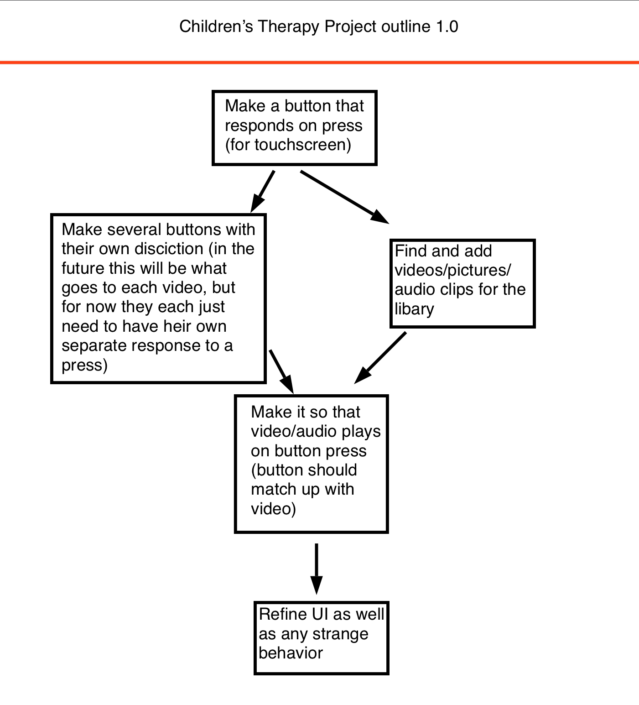

# Children'sTherapy

## Purpose:

This project will have a libary of buttons corresponding to different objects
that kids can press to see a short video of the object as a reward. This is to
assist in children't therapy efforts and ideally it should be able to easily
expand the libary

## This is the working design chart

# 
